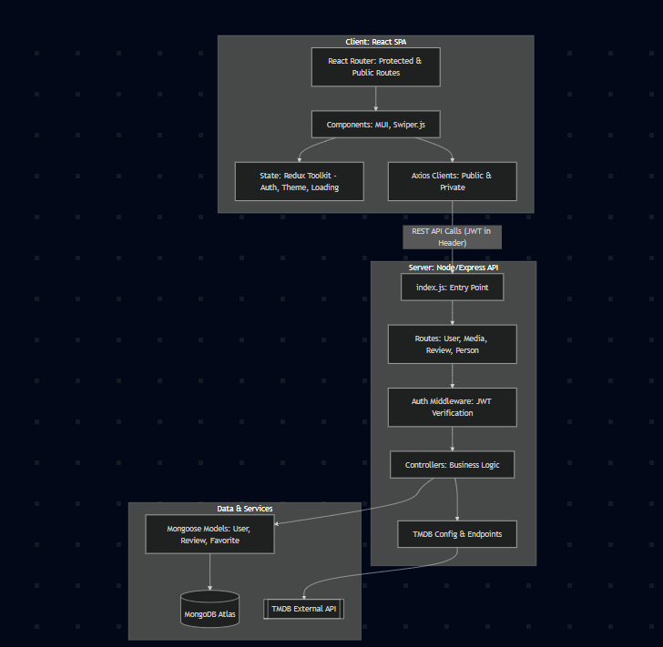

# BACKEND DEPLOYMENT FOR A NODEJS, MONGODB APPLICATION



## Get the right version of node js and npm to install
- Check for the main file in the package.json file e.g "react": "^19.0.0",


- Google: reactjs github


- Check for the releases numbers to know the date it was released - look for v19.0.0


- Get the date e.g 12th Dec 2024 then...


- Search for the stable lts version of node version used during that time


# Install that version
```bash
nvm install 22
node -v
npm -v
```


## To use the downloaded nvm version
```bash
 nvm use 22
 ```


## install  npm dependencies for the backend
```bash
npm install
```


## Start the node js engine and run the files
```bash
npm run start

```

## install mongodb locally
- Downloaded the community version msi
- Installed it alongside mongo compass
- Finished and added it to environment variables path

## Start the node js engine and run the files
```bash
npm run start
```
This still did not work so i added console.log("port: ", PORT) to the index.js file

## Edited .env and added the mongo-url and port
Noted that it was using keys_dev.js, so i edited that too
Did npm run start again and voila
```bash
npm run start

port: 8000

connected to a db
```

Once Successful, This will open node and the right port to view it on your browser.


# Dockerizing the application

- Create a dockerfile 

## Next verify the dockerfile is in the root

``` bash
docker --version
docker build -t my-react-app .
```

## To create the container with the build 
```bash
docker run -d -p 8080:80 --name my-container my-react-app 
```    


